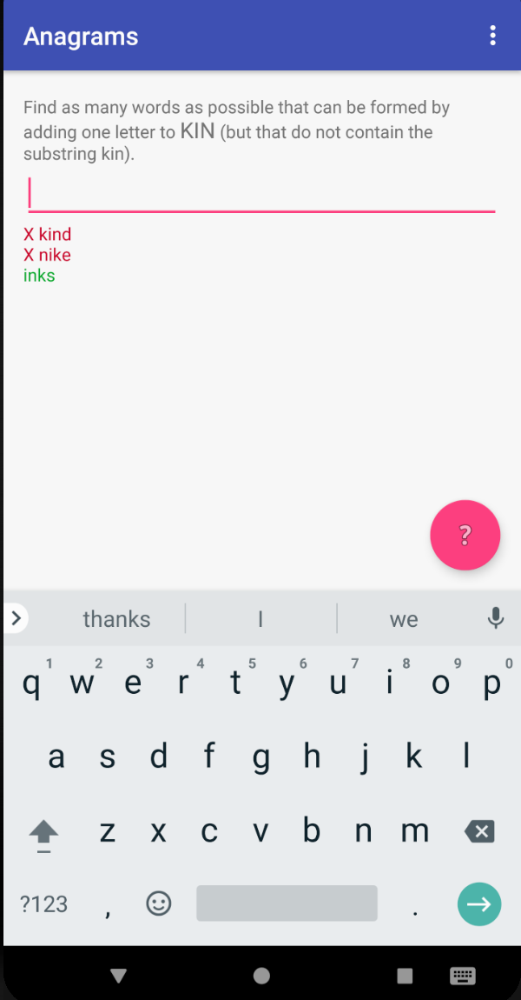
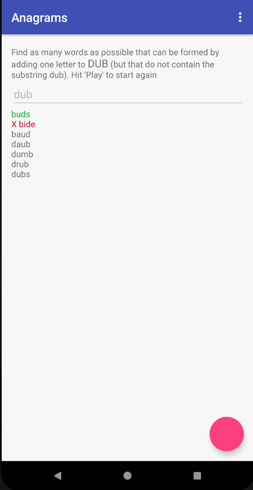
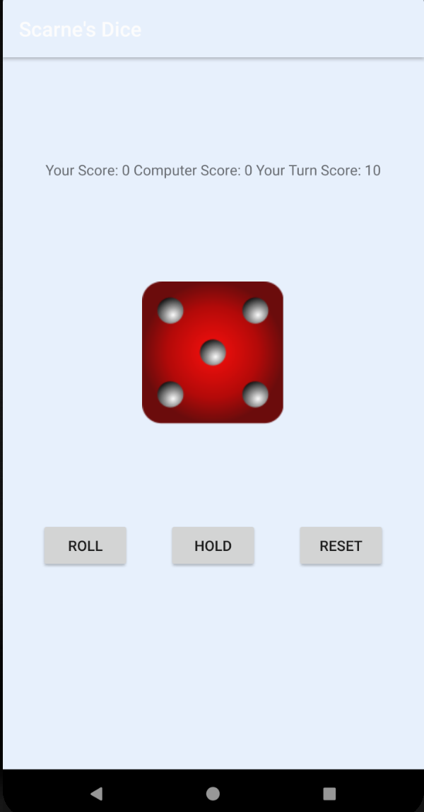
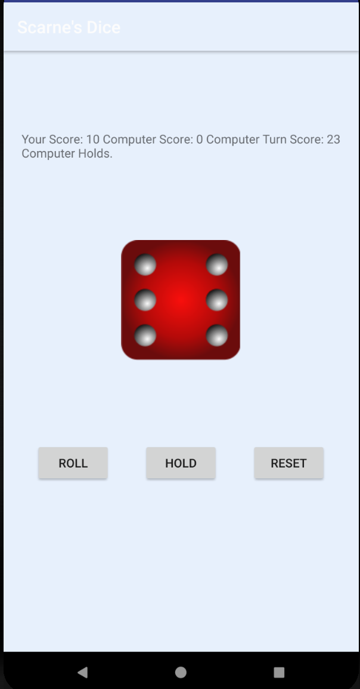
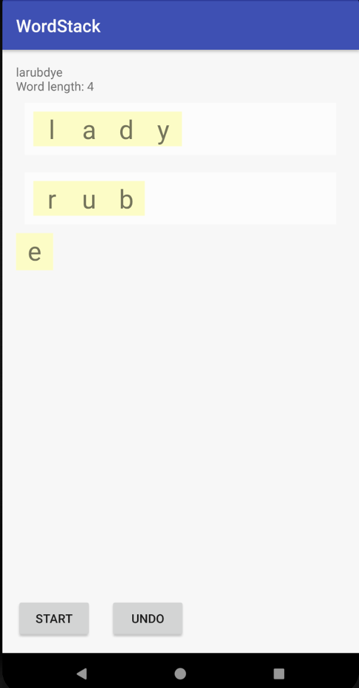
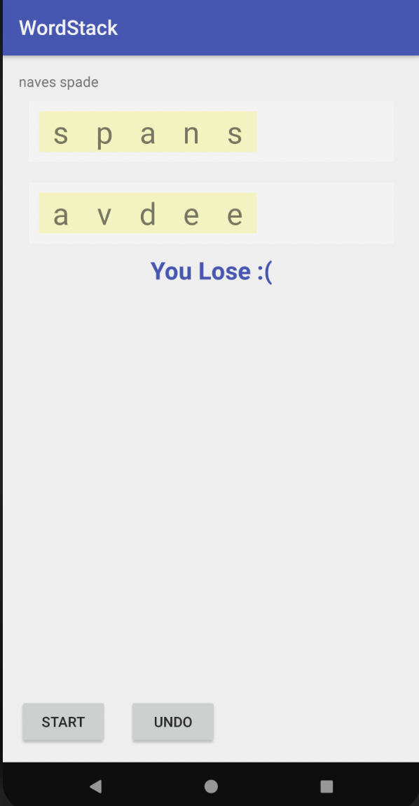

# Google Applied CS with Android Apps

Games created on Android Studio by following Google's Applied CS with Android workshop. 
https://appliedcsskills.withgoogle.com

### List of Games 

* **Anagrams:** 
Used ArrayLists, HashMaps and HashSets as underlying structures of the game. The user has to make anagrams of a given word by adding one more letter to it. The given word cannot be a substring of the anagram. Correct anagrams are displayed in green and wrong ones in red. 

 &nbsp;&nbsp;&nbsp;   

* **Scarne's Dice:** 
An app that uses asynchronous programming and allows to user to play a dice roll game against the computer. The user rolls a dice and either holds, or their turn is terminated if they roll a one. 

  &nbsp;&nbsp;&nbsp;    

* **Word Stack:** 
This app uses Stacks as the underlying structures. It takes two random words and scrambles it, without changing the order of the letters. The user can either drag the letters or click on a specific boxes to move the letters. The difficulty increases with every new game. 

  &nbsp;&nbsp;&nbsp;    
